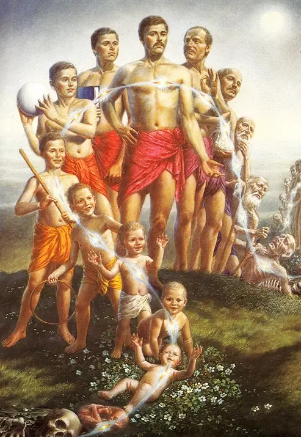

# **Sastric Study**

    

        
        
<em>Module 1: SSR Seminar</em>

    

    

        
        
<em>Module 2: Bhakti Yoga Seminar</em>

    

    

        
        
<em>Module 3: Goloka Chart Seminar</em>

    

    

        
        
<em>Module 4: Diksa Preparation</em>

    

